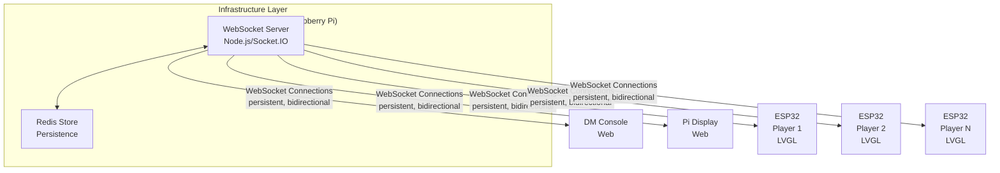
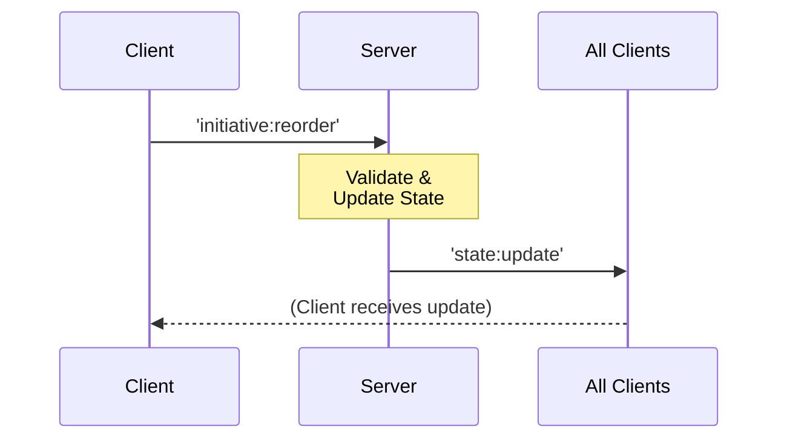
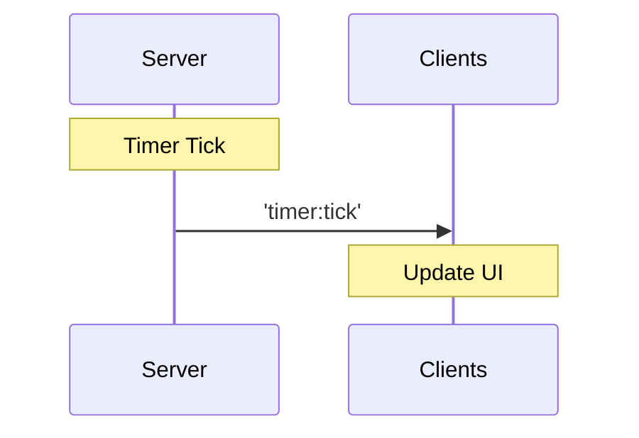
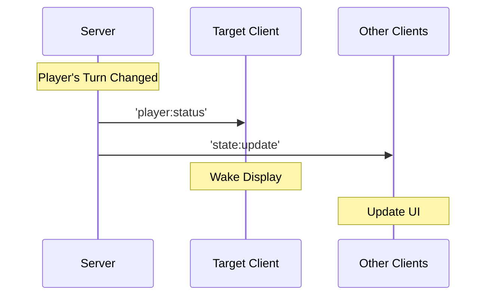

# Architecture Overview

## System Purpose

The Initiative Tracker is a distributed real-time system designed to manage combat turn order in tabletop role-playing games. It provides synchronized state across multiple heterogeneous devices with different capabilities and constraints.

## Core Principles

1. **Single Source of Truth**: Server maintains authoritative state
2. **Event-Driven**: All state changes propagate via WebSocket events
3. **Eventual Consistency**: Clients reconcile state on reconnection
4. **Graceful Degradation**: System continues operating with partial connectivity
5. **Zero-Touch Operation**: Player devices require minimal configuration

## Architectural Style

**Event-Driven Architecture with Central Coordinator**

The system follows a hub-and-spoke topology where:
- Server acts as the central coordinator and state manager
- All clients maintain local state synchronized via WebSocket events
- Clients can send commands that modify server state
- Server broadcasts state changes to all connected clients

## High-Level Component View



## Communication Flow

### 1. Client-to-Server Commands



### 2. Server-to-Client Broadcasts



### 3. Targeted Updates



## Data Flow Patterns

### Pattern 1: Command-Broadcast
Most common pattern for state changes:
1. Client sends command event
2. Server validates and updates state
3. Server broadcasts new state to all clients
4. Clients update local state and UI

### Pattern 2: Server-Initiated Broadcast
Used for autonomous server operations (timers):
1. Server internal logic triggers (timer countdown)
2. Server updates internal state
3. Server broadcasts to all clients
4. Clients update UI

### Pattern 3: Targeted Notification
Used for player-specific information:
1. Server determines affected client(s)
2. Server sends targeted event to specific client(s)
3. Server may also broadcast general update
4. Targeted clients react differently than others

## State Management

### Server State

The server maintains the complete, authoritative game state:

```javascript
{
  session_id: string,
  current_turn_index: number,
  round: number,
  timer: {
    active: boolean,
    remaining: number,
    duration: number
  },
  initiative_order: [
    {
      id: string,
      name: string,
      initiative: number,
      type: 'player' | 'npc',
      device_id?: string
    }
  ],
  metadata: {
    created_at: timestamp,
    last_modified: timestamp
  }
}
```

### Client State

Clients maintain a synchronized copy of relevant state:
- **DM Console**: Full state + UI state (drag operation, modals)
- **Pi Display**: Full state for rendering initiative list
- **ESP32 Players**: Minimal state (own position, timer, turn status)

### State Persistence

- **Redis**: Primary persistence layer for active sessions
- **JSON Files**: Long-term storage for saved sessions
- **In-Memory**: Server runtime state (fastest access)

State is persisted:
- On every state change (debounced)
- On explicit save command
- On graceful shutdown

## Scalability Considerations

### Current Design Supports:
- 1-12 player devices (typical game table)
- 1 DM console
- 1-2 shared displays
- ~15 concurrent WebSocket connections

### Performance Characteristics:
- **Latency**: <50ms for state propagation on local network
- **Throughput**: 100+ events/second capacity
- **Memory**: ~100MB server footprint
- **Storage**: <1MB per saved session

### Bottlenecks:
1. **WiFi bandwidth**: ESP32s on 2.4GHz WiFi
2. **Server CPU**: Timer updates (1 event/second, minimal)
3. **Redis I/O**: State persistence (not critical path)

## Fault Tolerance

### Network Interruption

**Client Disconnection:**
1. Socket.IO detects disconnection
2. Client enters "disconnected" state
3. Automatic reconnection attempts (exponential backoff)
4. On reconnection: server sends full state
5. Client reconciles and updates UI

**Server Restart:**
1. All clients detect disconnection
2. Server loads state from Redis on startup
3. Clients reconnect automatically
4. Server sends current state to reconnected clients

### Data Consistency

**Split-Brain Prevention:**
- Server is single source of truth
- Clients never modify state directly
- All changes flow through server validation

**Conflict Resolution:**
- Last-write-wins for concurrent operations
- Server timestamp-based ordering
- Critical operations (turn advancement) are serialized

### Recovery Procedures

**State Loss Prevention:**
- Redis persistence with AOF (Append-Only File)
- Periodic snapshots to disk
- Manual save checkpoints by DM

**Rollback Capability:**
- Named save states
- Restore to any saved checkpoint
- Undo not implemented (future enhancement)

## Security Considerations

### Current Implementation (Local Network Only)

**Authentication**: None (trusted local network)
**Authorization**: None (all clients trusted)
**Encryption**: None (plain WebSocket)

**Acceptable because:**
- System operates on isolated game table network
- No sensitive data
- Physical access controls

### Future Enhancements (If Internet-Exposed)

Would require:
- JWT-based authentication
- Role-based authorization (DM vs Player)
- WSS (WebSocket over TLS)
- Rate limiting
- Input validation and sanitization

## Technology Choices

### Why WebSocket (Socket.IO)?

**Pros:**
- True bidirectional real-time communication
- Automatic reconnection built-in
- Event-based programming model (intuitive)
- Excellent browser support
- Rooms/namespaces for targeted messaging

**Cons:**
- Slightly higher overhead than MQTT
- Requires persistent connections (not REST)
- More complex than polling for simple cases

**Alternatives Considered:**
- **MQTT**: More IoT-focused, requires separate broker
- **HTTP Long-Polling**: Higher latency, more overhead
- **Server-Sent Events**: One-way only (would need REST for commands)

### Why Redis?

**Pros:**
- In-memory speed for active sessions
- Simple key-value model matches needs
- Persistence options (RDB + AOF)
- Lightweight footprint

**Cons:**
- Overkill for single-session use case
- Additional infrastructure component

**Alternatives Considered:**
- **JSON Files**: Simpler, but slower and no transactional guarantees
- **SQLite**: More structure than needed
- **PostgreSQL**: Too heavy for this use case

### Why Node.js?

**Pros:**
- Excellent WebSocket ecosystem (Socket.IO)
- Event-driven model matches architecture
- JavaScript across full stack (web + server)
- Fast development iteration

**Cons:**
- Higher memory usage than Go/Rust
- Single-threaded (not relevant for this scale)

**Alternatives Considered:**
- **Python (FastAPI)**: Good, but less mature WebSocket libraries
- **Go**: More performant, but less WebSocket ecosystem
- **Rust**: Overkill for this project scope

## Design Patterns Used

1. **Observer Pattern**: Clients observe server state changes
2. **Command Pattern**: Client commands encapsulated as events
3. **Repository Pattern**: State persistence abstraction
4. **Singleton Pattern**: Single server state manager
5. **Publish-Subscribe**: Event broadcasting to all clients

## Quality Attributes

### Performance
- **Target**: <100ms end-to-end latency for state updates
- **Actual**: 20-50ms on local network

### Reliability
- **Target**: 99% uptime during game session
- **Mechanism**: Auto-reconnection, state persistence

### Maintainability
- **Strategy**: Clear separation of concerns, comprehensive documentation
- **Testing**: Integration tests for critical paths

### Usability
- **Goal**: Zero configuration for players, minimal for DM
- **Approach**: Sensible defaults, auto-discovery where possible

### Portability
- **Deployment**: Docker containers for consistent environments
- **Clients**: Web (universal) and ESP32 (hardware-specific)
