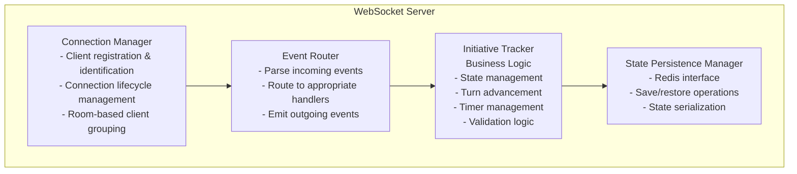
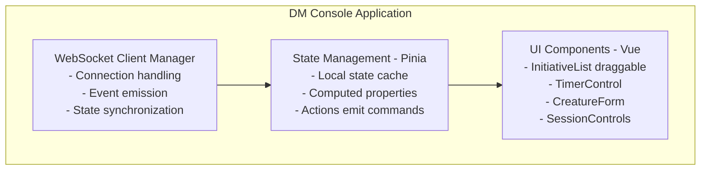
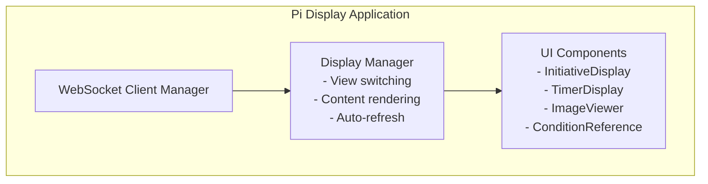
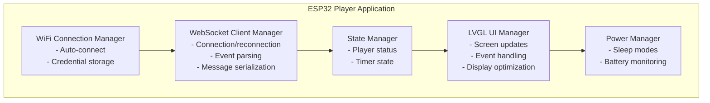
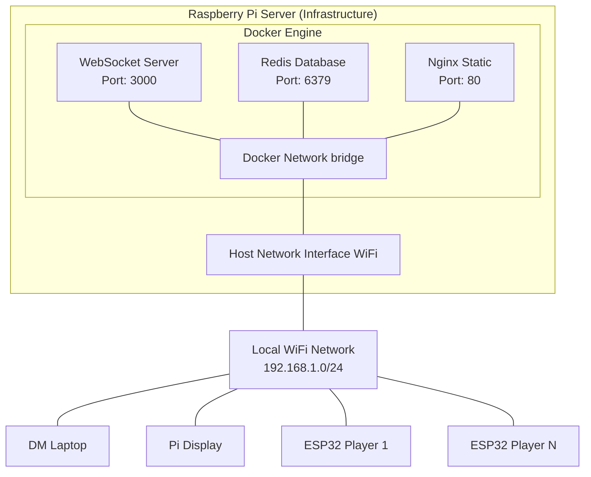
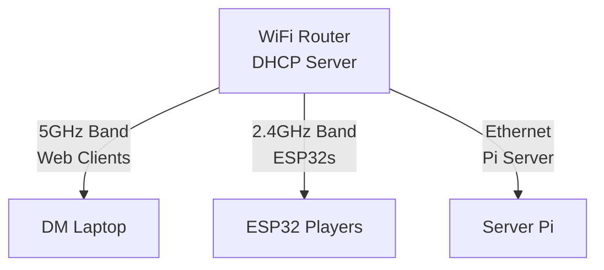
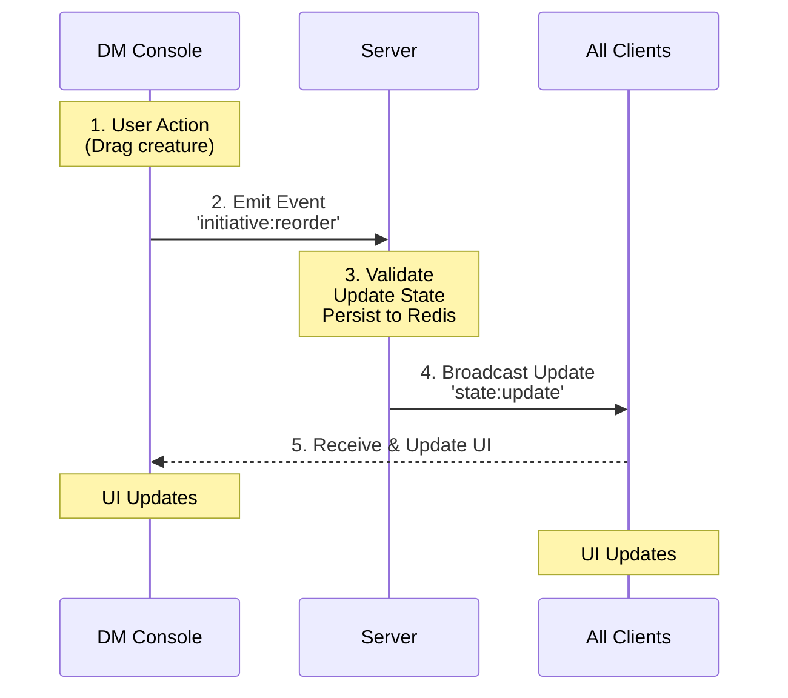
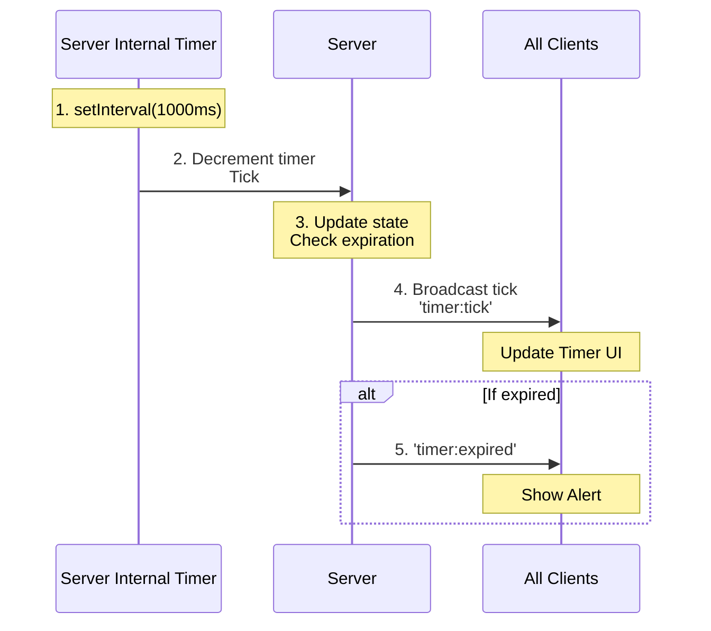
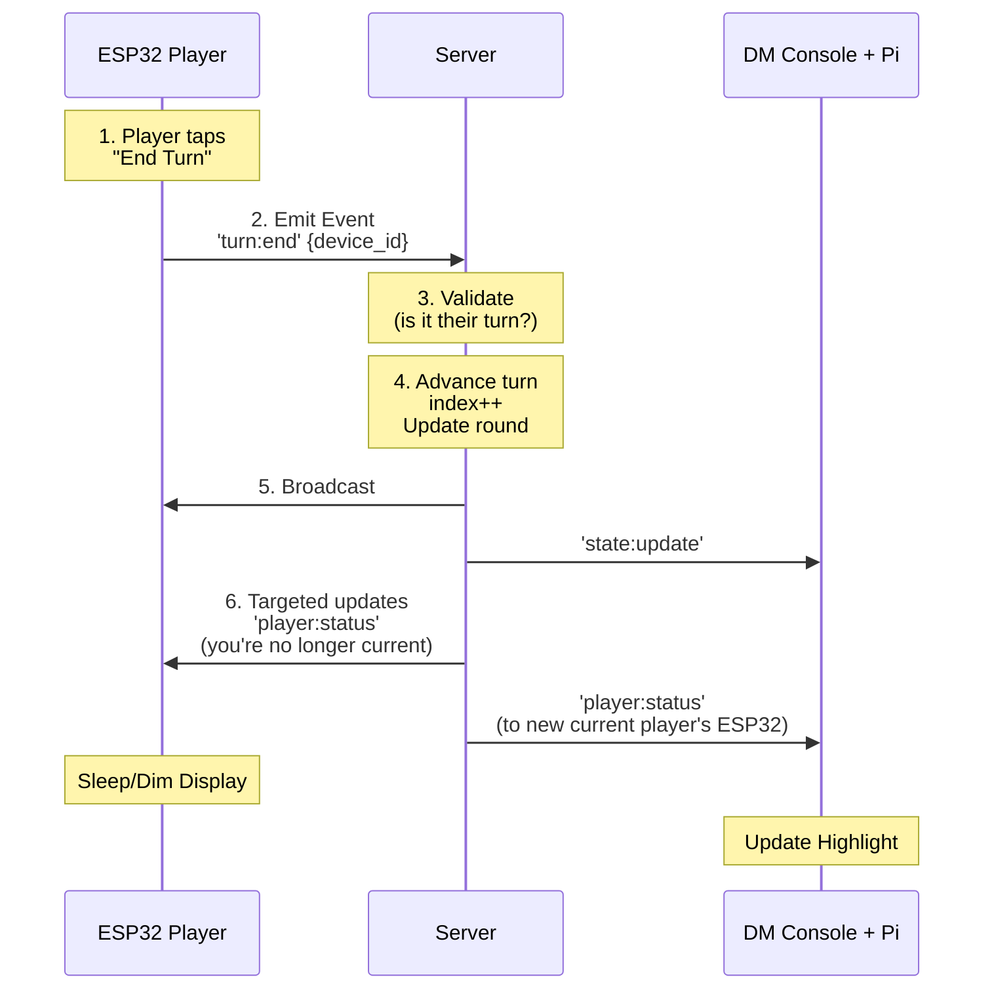

# System Architecture

## Component Architecture

### Server Components



### Client Component Hierarchy

#### DM Console (Web)



#### Pi Display (Web)



#### ESP32 Player Device (Embedded)



## Deployment Architecture

### Infrastructure Layout



### Container Configuration

#### docker-compose.yml Structure

```yaml
services:
  websocket-server:
    - Environment: NODE_ENV, REDIS_HOST, PORT
    - Depends on: redis
    - Ports: 3000:3000
    - Volumes: application code, node_modules
    - Restart: unless-stopped

  redis:
    - Volumes: persistent data storage
    - Ports: 6379 (internal only)
    - Config: AOF persistence enabled
    - Restart: unless-stopped

  nginx:
    - Volumes: static web files
    - Ports: 80:80
    - Config: WebSocket proxy pass
    - Restart: unless-stopped
```

## Network Architecture

### WiFi Topology



**Network Configuration:**
- Server Pi: Static IP (192.168.1.100)
- DM/Display: DHCP (auto-assigned)
- ESP32 Devices: DHCP with mDNS fallback
- DNS: Local hostname resolution (raspberrypi.local)

### Port Allocation

| Service | Port | Protocol | Access |
|---------|------|----------|--------|
| WebSocket Server | 3000 | WS/HTTP | External |
| Redis | 6379 | TCP | Internal only |
| Nginx (Web) | 80 | HTTP | External |
| Nginx (WebSocket) | 80/socket.io | WS | Proxy to 3000 |

## Data Flow Architecture

### State Synchronization Flow



### Timer Tick Flow



### Player Turn End Flow



## Scalability & Performance

### Connection Limits

**Current Design:**
- Max concurrent connections: 50
- Expected connections: 10-15
- Headroom: 3-5x

**Per Device Type:**
- DM Consoles: 1-2 (primary + backup)
- Pi Displays: 1-2 (main table + DM screen)
- ESP32 Players: 6-12 (typical game group)

### Performance Targets

| Metric | Target | Typical |
|--------|--------|---------|
| Event Latency | <100ms | 20-50ms |
| State Sync Time | <200ms | 50-100ms |
| Timer Precision | ±100ms | ±50ms |
| Reconnection Time | <5s | 1-3s |
| Memory (Server) | <200MB | 100-150MB |
| Memory (ESP32) | <100KB | 60-80KB |

### Bottleneck Analysis

**Potential Bottlenecks:**
1. WiFi bandwidth (2.4GHz congestion)
2. ESP32 JSON parsing speed
3. Redis write throughput (not critical path)
4. Server event loop blocking (prevented via async)

**Mitigation Strategies:**
1. Minimize message payload size
2. Use ArduinoJson streaming
3. Debounce state persistence
4. Keep event handlers non-blocking

## Resilience Patterns

### Retry Logic

**WebSocket Reconnection:**
```
Attempt 1: Immediate
Attempt 2: 1s delay
Attempt 3: 2s delay
Attempt 4: 4s delay
Attempt 5+: 5s delay (max)
Max attempts: Infinite
```

### Timeout Handling

| Operation | Timeout | Action |
|-----------|---------|--------|
| WebSocket Connect | 10s | Retry |
| State Sync | 5s | Request full state |
| Redis Write | 2s | Log error, continue |
| Event Acknowledgment | N/A | Fire-and-forget |

### State Recovery

**On Client Reconnection:**
1. Server detects new connection
2. Client sends identify event
3. Server responds with full current state
4. Client reconciles local state
5. Client updates UI to match server

**On Server Restart:**
1. Load state from Redis on startup
2. If no Redis state, start with empty session
3. Accept client connections
4. Send current state to all clients

## Monitoring & Observability

### Health Checks

**Server Health:**
- WebSocket connection count
- Redis connectivity status
- Memory usage
- Event processing rate

**Client Health:**
- Connection status (connected/disconnected)
- Last event timestamp
- Reconnection attempt count

### Logging Strategy

**Server Logs:**
- Connection events (connect, disconnect)
- State changes (with timestamp)
- Errors (with stack traces)
- Performance metrics (event processing time)

**Client Logs:**
- Connection status changes
- State sync events
- User actions
- Errors (network, parsing)

### Debugging Tools

- Chrome DevTools (WebSocket frame inspection)
- Redis CLI (state inspection)
- Docker logs (server output)
- Serial monitor (ESP32 debugging)
