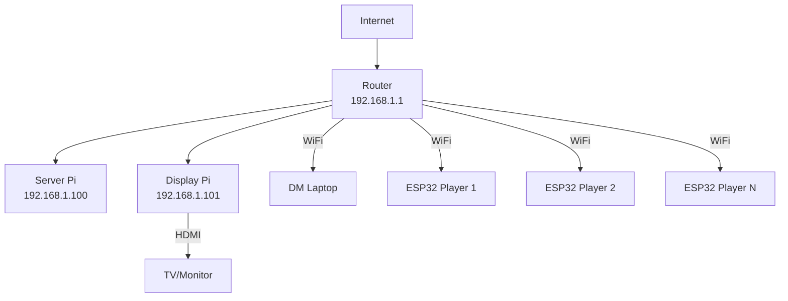

# Setup Guide

## Overview

This guide walks through setting up the complete Initiative Tracker system from scratch.

## Prerequisites

### Hardware Required

**Infrastructure Server:**
- 1x Raspberry Pi 3B+ or 4 (2GB RAM recommended)
- 1x 16GB+ microSD card (Class 10 or better)
- 1x 5V 2.5A+ power supply with micro-USB or USB-C
- 1x Ethernet cable (optional but recommended)

**Shared Display:**
- 1x Raspberry Pi 3B+ or 4
- 1x 16GB microSD card
- 1x 5V 2.5A+ power supply
- 1x HDMI monitor or TV (24"+ recommended)
- 1x HDMI cable

**DM Console:**
- Laptop or tablet with modern web browser

**Player Devices (per player):**
- 1x ESP32 development board
- 1x LCD touchscreen display (240x135, 320x240, or 480x320)
- 1x Li-Po battery (500-1000mAh) or USB power
- Jumper wires, breadboard or custom PCB
- 3D-printed enclosure (optional)

### Software Required

**For Raspberry Pi Setup:**
- Raspberry Pi Imager (https://www.raspberrypi.com/software/)
- SSH client (PuTTY for Windows, or built-in terminal for Mac/Linux)

**For ESP32 Development:**
- Arduino IDE 2.0+ (https://www.arduino.cc/en/software)
- Or VS Code with PlatformIO extension

**For Development (Optional):**
- Git
- Node.js 18+ LTS
- Docker Desktop (for local development)

---

## Part 1: Infrastructure Server Setup

### 1.1 Install Raspberry Pi OS

1. Download and install Raspberry Pi Imager
2. Insert microSD card into computer
3. Run Raspberry Pi Imager
4. Choose OS: **Raspberry Pi OS Lite (64-bit)** or Desktop version
5. Choose Storage: Your microSD card
6. Click gear icon for advanced settings:
   - Set hostname: `initiative-server`
   - Enable SSH with password authentication
   - Set username: `pi` (or your preference)
   - Set password
   - Configure WiFi SSID and password (if not using Ethernet)
   - Set locale settings
7. Click "Write" and wait for completion

### 1.2 Boot and Connect

1. Insert microSD card into Raspberry Pi
2. Connect Ethernet cable (recommended) or use WiFi
3. Connect power supply
4. Wait 60 seconds for boot
5. Find Pi's IP address:
   - Check your router's DHCP client list
   - Or try `ping initiative-server.local` (if mDNS works)
   - Or connect monitor/keyboard temporarily

### 1.3 SSH into Pi

```bash
# From your computer
ssh pi@<ip-address>
# or
ssh pi@initiative-server.local

# Enter password when prompted
```

### 1.4 Update System

```bash
sudo apt update
sudo apt upgrade -y
```

### 1.5 Install Docker

```bash
# Install Docker
curl -fsSL https://get.docker.com -o get-docker.sh
sudo sh get-docker.sh

# Add user to docker group
sudo usermod -aG docker pi

# Log out and back in for group change to take effect
exit
```

Reconnect via SSH, then verify:

```bash
docker --version
docker-compose --version
```

### 1.6 Configure Static IP (Recommended)

Edit dhcpcd.conf:

```bash
sudo nano /etc/dhcpcd.conf
```

Add at end of file (adjust for your network):

```
interface eth0
static ip_address=192.168.1.100/24
static routers=192.168.1.1
static domain_name_servers=192.168.1.1 8.8.8.8

# Or for WiFi:
interface wlan0
static ip_address=192.168.1.100/24
static routers=192.168.1.1
static domain_name_servers=192.168.1.1 8.8.8.8
```

Save (Ctrl+O, Enter) and exit (Ctrl+X).

Reboot:

```bash
sudo reboot
```

### 1.7 Clone Repository

```bash
cd ~
git clone https://github.com/yourusername/InitiativeTracker.git
cd InitiativeTracker
```

**Note:** If repository doesn't exist yet, you'll create the files manually or skip this step until code is written.

### 1.8 Configure Environment

```bash
cd ~/InitiativeTracker
cp .env.example .env
nano .env
```

Edit variables as needed:

```bash
NODE_ENV=production
PORT=3000
REDIS_HOST=redis
REDIS_PORT=6379
```

### 1.9 Build and Start Services

```bash
cd ~/InitiativeTracker
docker-compose up -d --build
```

Verify services are running:

```bash
docker-compose ps
```

Should show 3 containers running:
- websocket-server
- redis
- nginx

### 1.10 Enable Auto-Start on Boot

Create systemd service:

```bash
sudo nano /etc/systemd/system/initiative-tracker.service
```

Add content:

```ini
[Unit]
Description=Initiative Tracker Server
After=docker.service network-online.target
Requires=docker.service

[Service]
Type=oneshot
RemainAfterExit=yes
WorkingDirectory=/home/pi/InitiativeTracker
ExecStart=/usr/bin/docker-compose up -d
ExecStop=/usr/bin/docker-compose down
User=pi

[Install]
WantedBy=multi-user.target
```

Save and exit.

Enable service:

```bash
sudo systemctl enable initiative-tracker.service
sudo systemctl start initiative-tracker.service
```

Check status:

```bash
sudo systemctl status initiative-tracker.service
```

### 1.11 Test Server

From your computer's web browser, navigate to:

```
http://192.168.1.100
```

You should see the DM Console interface (once it's built).

---

## Part 2: Shared Display Setup

### 2.1 Install Raspberry Pi OS Desktop

Follow same process as 1.1, but choose:
- OS: **Raspberry Pi OS (Desktop, 64-bit)**
- Hostname: `initiative-display`
- Enable auto-login (in advanced settings)

### 2.2 Boot and Update

1. Connect HDMI cable to monitor/TV
2. Connect keyboard and mouse
3. Connect power
4. Wait for desktop to load
5. Open terminal and update:

```bash
sudo apt update
sudo apt upgrade -y
```

### 2.3 Configure WiFi (if needed)

Use desktop WiFi settings or:

```bash
sudo raspi-config
# Select: System Options > Wireless LAN
# Enter SSID and password
```

### 2.4 Install Chromium (if not already installed)

```bash
sudo apt install chromium-browser -y
```

### 2.5 Configure Kiosk Mode

Create autostart directory:

```bash
mkdir -p ~/.config/openbox
nano ~/.config/openbox/autostart
```

Add content:

```bash
# Disable screen blanking
xset s off
xset -dpms
xset s noblank

# Hide mouse cursor after 5 seconds of inactivity
unclutter -idle 5 &

# Start Chromium in kiosk mode
chromium-browser --kiosk --disable-infobars --disable-session-crashed-bubble \
  --disable-restore-session-state --noerrdialogs \
  --disable-translate --disable-features=TranslateUI \
  http://192.168.1.100/pi-display.html &
```

Save and exit.

Install unclutter (hides mouse cursor):

```bash
sudo apt install unclutter -y
```

### 2.6 Configure Auto-Login and Auto-Start X11

```bash
sudo raspi-config
```

Navigate to:
1. **System Options** → **Boot / Auto Login** → **Desktop Autologin**
2. **Finish** and reboot

The display should now boot directly to the Pi Display interface in full-screen.

### 2.7 Disable Screen Saver Permanently

Edit LightDM config:

```bash
sudo nano /etc/lightdm/lightdm.conf
```

Find `[Seat:*]` section and add/edit:

```ini
[Seat:*]
xserver-command=X -s 0 -dpms
```

Save and exit.

### 2.8 Test Display

Reboot the Pi:

```bash
sudo reboot
```

The display should:
1. Boot to desktop automatically
2. Launch Chromium in kiosk mode
3. Display the Pi Display interface
4. Never show screensaver or go to sleep

---

## Part 3: DM Console Setup

### 3.1 Laptop/Tablet Setup

No special setup required! Simply:

1. Ensure device is on same network as server
2. Open web browser (Chrome, Firefox, Safari, or Edge)
3. Navigate to: `http://192.168.1.100`
4. Bookmark for easy access

**For tablets:**
- Add to home screen for app-like experience
- Chrome: Menu → "Add to Home screen"
- Safari: Share → "Add to Home Screen"

### 3.2 Verify Connection

You should see:
- Initiative tracker interface loads
- Connection status indicator shows "Connected"
- Can add/remove creatures
- State syncs with Pi display

---

## Part 4: ESP32 Player Device Setup

### 4.1 Hardware Assembly

**Wiring Example (for ESP32 + SPI Display):**

| Display Pin | ESP32 Pin |
|-------------|-----------|
| VCC | 3.3V |
| GND | GND |
| SCL/SCK | GPIO 18 |
| SDA/MOSI | GPIO 23 |
| RES/RST | GPIO 4 |
| DC | GPIO 2 |
| CS | GPIO 15 |
| BLK/LED | GPIO 5 (or 3.3V) |

**Note:** Pin assignments vary by display. Consult your display's documentation.

**For battery power:**
- Connect Li-Po battery to ESP32 battery connector (if available)
- Or use battery shield/charging module

### 4.2 Install Arduino IDE and Libraries

1. Install Arduino IDE 2.0+
2. Add ESP32 board support:
   - File → Preferences
   - Additional Board Manager URLs: `https://dl.espressif.com/dl/package_esp32_index.json`
   - Tools → Board → Boards Manager
   - Search "esp32" and install "esp32 by Espressif Systems"

3. Install required libraries:
   - Sketch → Include Library → Manage Libraries
   - Search and install:
     - **LVGL** (by LVGL)
     - **WebSockets** (by Markus Sattler)
     - **ArduinoJson** (by Benoit Blanchon)
     - **TFT_eSPI** (by Bodmer) - or appropriate display library

### 4.3 Configure Display Library

Edit TFT_eSPI configuration (or create User_Setup.h):

Location: `Arduino/libraries/TFT_eSPI/User_Setup.h`

Example for ST7789 240x135 display:

```cpp
#define ST7789_DRIVER
#define TFT_WIDTH  135
#define TFT_HEIGHT 240
#define TFT_MOSI 23
#define TFT_SCLK 18
#define TFT_CS   15
#define TFT_DC    2
#define TFT_RST   4
#define TFT_BL    5
#define SPI_FREQUENCY  40000000
```

Adjust for your specific display.

### 4.4 Configure Firmware

Open ESP32 firmware in Arduino IDE:

```
InitiativeTracker/firmware/player-device/player-device.ino
```

Edit configuration section:

```cpp
// WiFi Configuration
const char* WIFI_SSID = "YourNetworkName";
const char* WIFI_PASSWORD = "YourPassword";

// Server Configuration
const char* SERVER_HOST = "192.168.1.100";
const uint16_t SERVER_PORT = 80;

// Device Configuration
const char* DEVICE_ID = "esp32_001";  // Unique for each device

// Display Configuration
#define DISPLAY_WIDTH 240
#define DISPLAY_HEIGHT 135
```

### 4.5 Upload Firmware

1. Connect ESP32 to computer via USB
2. Select board: Tools → Board → ESP32 Dev Module
3. Select port: Tools → Port → (your COM port)
4. Click Upload button
5. Wait for upload to complete

### 4.6 Test Device

1. Open Serial Monitor (Tools → Serial Monitor, 115200 baud)
2. Reset ESP32 (press EN button)
3. Watch for:
   - WiFi connection
   - WebSocket connection to server
   - "Connected to server" message
4. Device screen should show "Waiting..." or current turn status

### 4.7 Repeat for Each Player

For each additional player device:
1. Change `DEVICE_ID` to unique value (esp32_002, esp32_003, etc.)
2. Upload firmware
3. Test connection

**Tip:** Keep a list of device IDs and which player owns each device.

---

## Part 5: Network Configuration

### 5.1 Router Configuration (Optional)

**For stability, configure your router:**

1. Reserve DHCP address for server Pi (192.168.1.100)
2. Reserve DHCP address for display Pi (192.168.1.101)
3. Set lease time to maximum (reduces reconnection issues)

### 5.2 Firewall Configuration

If running firewall on server Pi, allow ports:

```bash
sudo ufw allow 80/tcp
sudo ufw allow 3000/tcp
sudo ufw enable
```

### 5.3 DNS/mDNS Configuration

Install Avahi (mDNS) for easier access:

```bash
sudo apt install avahi-daemon -y
sudo systemctl enable avahi-daemon
sudo systemctl start avahi-daemon
```

Now you can access server at: `http://initiative-server.local`

---

## Part 6: Verification and Testing

### 6.1 Component Checklist

Verify each component:

- [ ] Server Pi running and accessible
- [ ] Docker containers running (websocket-server, redis, nginx)
- [ ] Display Pi boots to kiosk mode showing initiative tracker
- [ ] DM console accessible from laptop/tablet browser
- [ ] ESP32 devices connect and show status
- [ ] All devices on same network

### 6.2 Functional Testing

Test core functionality:

1. **Add creature from DM console**
   - [ ] Appears on DM console
   - [ ] Appears on Pi display
   - [ ] Initiative sorted correctly

2. **Advance turn**
   - [ ] Current turn highlights
   - [ ] ESP32 shows "YOUR TURN" for active player
   - [ ] ESP32 shows "On Deck" for next player

3. **Start timer**
   - [ ] Timer displays on all devices
   - [ ] Counts down in sync
   - [ ] Expires correctly

4. **Player ends turn via ESP32**
   - [ ] Initiative advances
   - [ ] Turn updates on all devices

5. **Save and restore session**
   - [ ] Save completes successfully
   - [ ] Restore loads correct state

6. **Reconnection**
   - [ ] Disconnect ESP32 (turn off WiFi temporarily)
   - [ ] ESP32 reconnects automatically
   - [ ] State resynchronizes

### 6.3 Performance Testing

Monitor performance:

```bash
# On server Pi
docker stats

# Check CPU and memory usage
```

Expected:
- RAM: <200MB total
- CPU: <30% under normal use

### 6.4 Network Testing

Test from various locations at game table:

- [ ] ESP32s maintain connection
- [ ] Latency <100ms (test by observing state sync speed)
- [ ] No dropped events

---

## Part 7: Troubleshooting

### Server Won't Start

**Check Docker:**
```bash
docker-compose logs
```

**Check ports:**
```bash
sudo netstat -tulpn | grep 80
```

**Restart services:**
```bash
docker-compose down
docker-compose up -d
```

### Display Shows Blank/Error

**Check URL in autostart:**
```bash
nano ~/.config/openbox/autostart
```

Verify URL is correct.

**Test manually:**
```bash
chromium-browser http://192.168.1.100/pi-display.html
```

**Check network:**
```bash
ping 192.168.1.100
```

### ESP32 Won't Connect

**Check serial output:**
- Look for WiFi connection errors
- Verify SSID/password correct
- Check signal strength

**Check server reachability:**
```bash
ping 192.168.1.100  # from computer on same network
```

**Verify WebSocket server running:**
```bash
curl http://192.168.1.100
```

### State Not Syncing

**Check WebSocket connection:**
- Open browser console (F12) on DM console
- Look for WebSocket connection errors
- Verify "connected" status

**Check Redis:**
```bash
docker exec -it initiative-tracker_redis_1 redis-cli
127.0.0.1:6379> KEYS *
127.0.0.1:6379> GET initiative:state
```

### Performance Issues

**Reduce load:**
- Fewer creatures in initiative
- Disable animations
- Lower ESP32 screen refresh rate

**Check network:**
- Move closer to WiFi router
- Reduce interference (2.4GHz congestion)
- Use 5GHz WiFi if available

---

## Part 8: Maintenance

### Regular Maintenance

**Weekly:**
- Check disk space: `df -h`
- Check logs: `docker-compose logs --tail=100`

**Monthly:**
- Update system: `sudo apt update && sudo apt upgrade`
- Restart services: `docker-compose restart`

**Before game sessions:**
- Charge ESP32 batteries
- Test all connections
- Verify latest session saved/loaded correctly

### Backup Procedure

**Manual backup:**
```bash
# On server Pi
cd ~/InitiativeTracker
docker-compose exec redis redis-cli BGSAVE

# Copy backup
sudo cp /var/lib/docker/volumes/initiative-tracker_redis-data/_data/dump.rdb \
  ~/backups/redis-$(date +%Y%m%d).rdb
```

**Automated backup (optional):**
```bash
# Add to crontab
crontab -e

# Add line for daily backup at 3am:
0 3 * * * cd ~/InitiativeTracker && docker-compose exec redis redis-cli BGSAVE
```

### Updates

**Update application:**
```bash
cd ~/InitiativeTracker
git pull
docker-compose down
docker-compose up -d --build
```

**Update ESP32 firmware:**
1. Connect ESP32 via USB
2. Open latest firmware in Arduino IDE
3. Upload to device
4. Repeat for each ESP32

---

## Part 9: Tips and Best Practices

### Network Setup

- Use dedicated WiFi network for game (avoid congestion)
- Place router centrally for best coverage
- Use 5GHz WiFi for DM console and display (less interference)
- Keep ESP32s on 2.4GHz (longer range)

### Power Management

- Keep server and display Pi plugged in (don't rely on battery)
- Charge ESP32 devices after each session
- Consider USB power for ESP32s if playing at home

### Organization

- Label each ESP32 with player name or number
- Keep list of device IDs and player assignments
- Create charging station for ESP32 devices

### Backup Strategy

- Save session at end of each game night
- Name saves descriptively: "Dragon Fight Part 1"
- Keep backup saves for important battles

---

## Appendix A: Bill of Materials

See [device-specifications.md](../requirements/device-specifications.md) for detailed BOM.

## Appendix B: Network Diagram



## Appendix C: Port Reference

| Service | Port | Protocol | Access |
|---------|------|----------|--------|
| HTTP/WebSocket | 80 | TCP | External |
| WebSocket Server | 3000 | TCP | Internal (Docker) |
| Redis | 6379 | TCP | Internal (Docker) |
| SSH (Server Pi) | 22 | TCP | Admin only |
| SSH (Display Pi) | 22 | TCP | Admin only |

---

## Getting Help

- Check [troubleshooting section](#part-7-troubleshooting)
- Review server logs: `docker-compose logs`
- Check serial output from ESP32
- Open issue on GitHub repository
- Consult documentation in `/docs` folder
